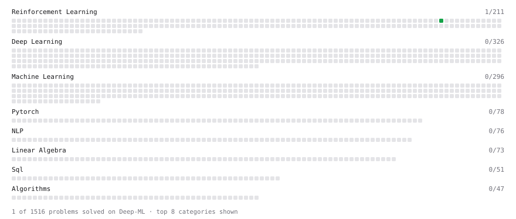

# Deep-ML

My machine learning practice from [Deep-ML](https://www.deep-ml.com). Every solution here was written by hand.

**9** solved · 9 problems · 0 labs · 0 math

[**Browse the interactive portfolio**](https://Shourya-2011.github.io/deep-ml/) to replay this filling in over time.

## Problems

| | Difficulty | Solved | |
| --- | --- | --- | --- |
| [Build a Multi-Armed Bandit Testbed](https://www.deep-ml.com/problems/542) | easy | 2026-10-03 | [solution](problems/0542-build-a-multi-armed-bandit-testbed) |
| [Estimate Action Values Using Sample Averaging](https://www.deep-ml.com/problems/543) | easy | 2026-10-03 | [solution](problems/0543-estimate-action-values-using-sample-averaging) |
| [Exponential Weighted Average of Rewards](https://www.deep-ml.com/problems/161) | easy | 2026-10-04 | [solution](problems/0161-exponential-weighted-average-of-rewards) |
| [Incremental Mean for Online Reward Estimation](https://www.deep-ml.com/problems/159) | easy | 2026-10-04 | [solution](problems/0159-incremental-mean-for-online-reward-estimation) |
| [Optimistic Initialization for Exploration](https://www.deep-ml.com/problems/509) | easy | 2026-10-04 | [solution](problems/0509-optimistic-initialization-for-exploration) |
| [Random Rotation Matrix and a Rotation Layer](https://www.deep-ml.com/problems/1190) | easy | 2026-10-05 | [solution](problems/1190-random-rotation-matrix-and-a-rotation-layer) |
| [Reshape Matrix](https://www.deep-ml.com/problems/3) | easy | 2026-10-08 | [solution](problems/0003-reshape-matrix) |
| [Upper Confidence Bound (UCB) Action Selection](https://www.deep-ml.com/problems/162) | easy | 2026-10-04 | [solution](problems/0162-upper-confidence-bound-ucb-action-selection) |
| [Epsilon-Greedy Action Selection for n-Armed Bandit](https://www.deep-ml.com/problems/158) | medium | 2026-10-04 | [solution](problems/0158-epsilon-greedy-action-selection-for-n-armed-bandit) |

---

_This file is regenerated by Deep-ML on every push._
